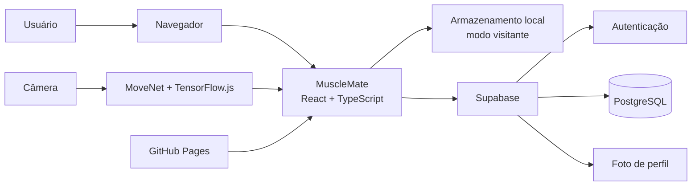

# ADR 0001 — Arquitetura geral do MuscleMate

- **Status:** Aceita e em uso
- **Data:** 19/09/2026
- **Responsável:** Equipe MuscleMate

## 1. Objetivo deste documento

Este documento explica, de maneira simples, como o MuscleMate foi construído e por que suas principais tecnologias foram escolhidas.

O MuscleMate possui duas funções principais:

1. corrigir a postura do usuário durante exercícios, usando a câmera em tempo real;
2. permitir o planejamento e o registro de treinos, séries, repetições e cargas.

## 2. Decisão arquitetônica principal

O sistema usa uma **arquitetura cliente-servidor com um front-end monolítico modular e um backend gerenciado como serviço**.

Em termos mais simples:

- existe uma única aplicação web, dividida internamente em páginas, componentes e módulos;
- essa aplicação roda principalmente no navegador do usuário;
- autenticação, banco de dados e armazenamento são fornecidos pelo Supabase;
- não existem microserviços nem um servidor próprio do MuscleMate neste momento.

Portanto, se for necessário escolher somente entre "monolítico" e "microserviços", o MuscleMate deve ser classificado como um **monólito modular no front-end, integrado a um backend externo gerenciado**.

## 3. Linguagens utilizadas

### TypeScript

É a principal linguagem do projeto. Ela é usada nas telas, componentes, regras de negócio, contagem de repetições e integração com o Supabase.

Foi escolhida porque adiciona tipos ao JavaScript. Isso permite detectar vários erros antes da publicação e facilita a manutenção de dados importantes, como exercícios, séries e resultados posturais.

### TSX

TSX é a forma de escrever componentes React usando TypeScript junto com a estrutura visual da página. Ele é usado nos arquivos de telas e componentes.

Foi escolhido porque deixa a interface e seu comportamento próximos no mesmo componente, facilitando a criação de telas interativas.

### CSS

O CSS define cores, espaçamentos, fontes, responsividade e aparência geral. O projeto utiliza CSS junto com Tailwind CSS.

Foi escolhido porque é o padrão dos navegadores para apresentação visual.

### SQL

SQL é usado nas migrações do Supabase para criar tabelas, relacionamentos, validações e regras de segurança.

Foi escolhido porque o banco do Supabase é PostgreSQL, um banco relacional adequado para usuários, treinos, exercícios e séries relacionados entre si.

### HTML

O HTML fornece a estrutura inicial carregada pelo navegador. A maior parte do conteúdo da interface é criada pelo React.

### JSON e YAML

Não são linguagens principais da aplicação, mas são usados para configuração de dependências, ferramentas e publicação automática no GitHub.

## 4. Tecnologias e decisões

### React

O React organiza a interface em componentes reutilizáveis, como barra de navegação, formulários, cards de treino e tela de análise.

Foi escolhido porque o sistema possui muitas interações em tempo real e estados que mudam frequentemente, como exercício selecionado, câmera, repetições e feedbacks.

### Vite

O Vite prepara o ambiente de desenvolvimento e gera a versão otimizada para produção.

Foi escolhido por ser rápido, simples e adequado a aplicações React modernas.

### TensorFlow.js e MoveNet

Essas tecnologias detectam pontos do corpo a partir da imagem da câmera. O MuscleMate usa esses pontos para calcular ângulos, reconhecer fases do movimento e contar repetições.

O processamento ocorre no navegador. Essa decisão reduz o atraso do feedback e evita enviar continuamente o vídeo da câmera para um servidor. O desempenho pode variar conforme o aparelho do usuário.

### WebGL

O WebGL ajuda o navegador a usar a placa gráfica para acelerar o modelo de detecção corporal.

### Supabase

O MuscleMate usa **Supabase, e não Firebase**.

O Supabase fornece:

- cadastro, login e recuperação de senha;
- banco PostgreSQL;
- armazenamento da foto de perfil;
- API automática para acesso aos dados;
- Row Level Security (RLS), que limita cada usuário aos próprios dados.

Ele foi escolhido porque reduz a necessidade de construir e manter um servidor próprio, oferece banco relacional e permite aplicar segurança diretamente no banco.

O Firebase poderia cumprir parte dessas funções, mas não faz parte da arquitetura atual. Trocar para Firebase exigiria uma migração de autenticação, banco, armazenamento e código de integração, sem benefício necessário neste momento.

### Tailwind CSS e Radix UI

O Tailwind acelera a construção visual com estilos padronizados. O Radix UI fornece componentes acessíveis para elementos interativos.

Foram escolhidos para manter uma interface consistente, responsiva e mais fácil de evoluir.

### Framer Motion

É usado para animações e transições da interface. Seu objetivo é melhorar a percepção de fluidez sem interferir nas regras dos exercícios.

### GitHub e GitHub Pages

O GitHub armazena o código e seu histórico de alterações. O GitHub Pages hospeda a aplicação web estática.

Essa opção foi escolhida por ser simples, possuir HTTPS e permitir publicação automática a cada atualização aprovada na branch principal.

### Vitest e ESLint

O Vitest executa testes automatizados das regras de contagem, validação e registro. O ESLint identifica problemas e inconsistências no código.

Essas ferramentas reduzem o risco de uma alteração quebrar comportamentos existentes.

## 5. Como os dados funcionam

### Usuário autenticado

Treinos, exercícios, séries e dados de perfil são salvos no Supabase. As regras RLS verificam a identidade do usuário antes de permitir leitura ou alteração.

### Usuário visitante

O modo visitante salva informações somente no armazenamento local do navegador. Esses dados podem ser perdidos se o usuário limpar os dados do navegador ou trocar de aparelho.

### Câmera

A imagem é usada localmente para estimar a postura. A arquitetura atual não grava nem envia o vídeo para o Supabase.

## 6. Organização do código

- `src/pages`: telas completas da aplicação;
- `src/components`: componentes visuais reutilizáveis;
- `src/lib`: regras de exercícios, contadores e registro de treinos;
- `src/hooks`: comportamentos reutilizáveis, como autenticação;
- `src/integrations/supabase`: conexão e tipos do banco;
- `src/test`: testes automatizados;
- `supabase/migrations`: estrutura e regras do banco em SQL;
- `.github/workflows`: publicação automática.

Essa divisão torna o monólito modular: existe uma aplicação única, mas suas responsabilidades ficam separadas em pastas e módulos.

## 7. Benefícios da arquitetura atual

- desenvolvimento e publicação simples;
- baixo custo operacional;
- feedback postural com pouco atraso;
- menor exposição das imagens da câmera;
- autenticação e banco sem manter um servidor próprio;
- estrutura suficiente para a fase atual do produto.

## 8. Limitações e consequências

- aparelhos menos potentes podem ter desempenho inferior na análise postural;
- o front-end pode crescer e precisar de divisão de código para reduzir o carregamento inicial;
- regras sensíveis devem permanecer protegidas por RLS, pois o código do navegador é visível;
- o GitHub Pages hospeda somente conteúdo estático e não executa um servidor próprio;
- o sistema depende da disponibilidade do Supabase para recursos autenticados;
- dados do modo visitante não são sincronizados entre dispositivos.

## 9. Quando reavaliar esta decisão

A arquitetura deve ser revista se o sistema precisar de processamento pesado no servidor, integração com pagamentos, tarefas em segundo plano, regras privadas complexas, grande crescimento de usuários ou integração com muitos serviços externos.

Mesmo nesses casos, a adoção de microserviços não deve ser automática. Primeiro deve ser avaliado se um backend modular único resolve o problema com menor complexidade.

